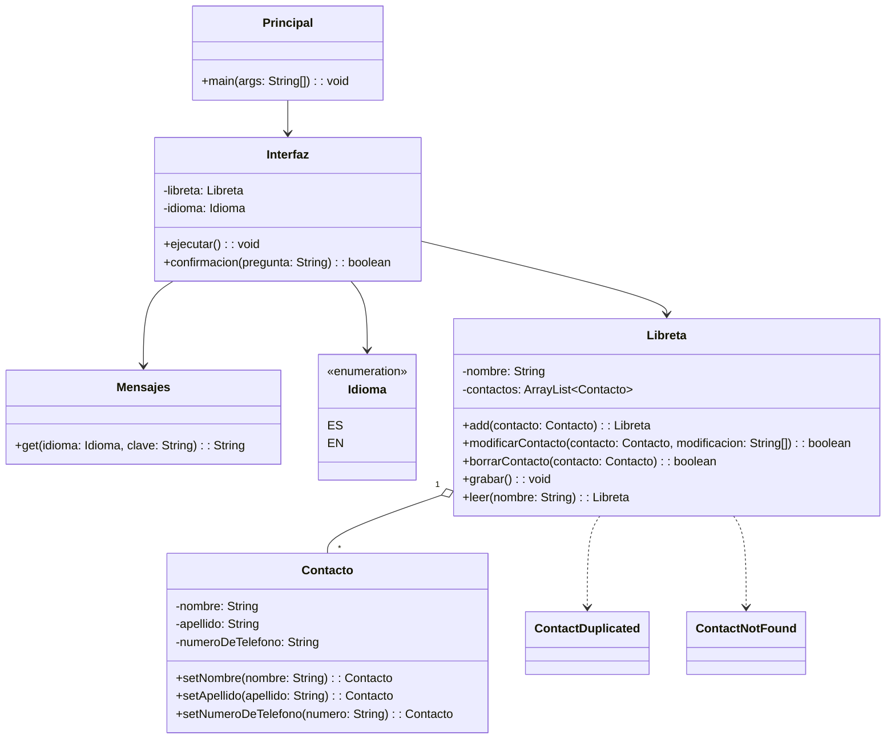

# Agenda Contactos UML

```mermaid
classDiagram
    class Principal {
        +main(args: String[]): void
    }

    class Interfaz {
        -libreta: Libreta
        -idioma: Idioma
        +ejecutar(): void
        +confirmacion(pregunta: String): boolean
    }

    class Mensajes {
        +get(idioma: Idioma, clave: String): String
    }

    class Idioma {
        <<enumeration>>
        ES
        EN
    }

    class Libreta {
        -nombre: String
        -contactos: ArrayList~Contacto~
        +add(contacto: Contacto): Libreta
        +modificarContacto(contacto: Contacto, modificacion: String[]): boolean
        +borrarContacto(contacto: Contacto): boolean
        +grabar(): void
        +leer(nombre: String): Libreta
    }

    class Contacto {
        -nombre: String
        -apellido: String
        -numeroDeTelefono: String
        +setNombre(nombre: String): Contacto
        +setApellido(apellido: String): Contacto
        +setNumeroDeTelefono(numero: String): Contacto
    }

    class ContactDuplicated
    class ContactNotFound

    Principal --> Interfaz
    Interfaz --> Libreta
    Interfaz --> Mensajes
    Interfaz --> Idioma
    Libreta "1" o-- "*" Contacto
    Libreta ..> ContactDuplicated
    Libreta ..> ContactNotFound
```
